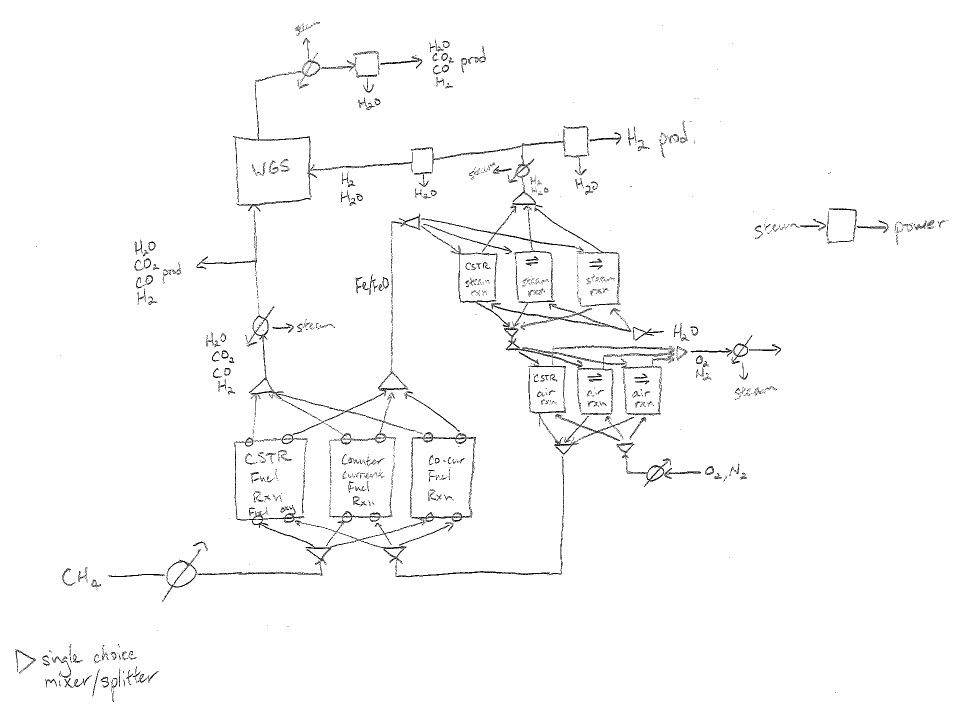

==========================================================
Chemical Looping Combustion Flowsheet
==========================================================

This guide explains the progress of conceptual design work for the chemical looping combustion process.
This draft was written for the presentation on 27 Feb, 2017 based on commit `5a75855 <https://github.com/qtothec/models/commit/5a75855417b2ed604f2f868e369f97c0d6fdc69d>`_.

For a general overview of the IDAES conceptual design framework, please refer to :ref:`conceptual-design-overview`.

.. contents:: Contents
		:depth: 2

Unit model files
================

The unit models for the CLC flowsheet are located in the idaes_models.unit.clc directory.
These consist of the air, steam, and fuel reactors:

.. module:: idaes_models.unit.clc.air_rxn_cocur

.. autoclass:: AirRxnCocur
		:members:

.. module:: idaes_models.unit.clc.air_rxn_counter

.. autoclass:: AirRxnCounter
		:members:

.. module:: idaes_models.unit.clc.steam_rxn_cocur

.. autoclass:: SteamRxnCocur
		:members:

.. module:: idaes_models.unit.clc.steam_rxn_counter

.. autoclass:: SteamRxnCounter
		:members:

.. module:: idaes_models.unit.clc.fuel_rxn_cocur

.. autoclass:: FuelRxnCocur
		:members:

.. module:: idaes_models.unit.clc.fuel_rxn_counter

.. autoclass:: FuelRxnCounter
		:members:

These files contain all of the variable, parameter, and equation definitions for the co-current and counter-current equilibrium reactors.
They also contain logic for the initialization procedure to use for the particular unit.

Flowsheet definition
====================

The flowsheet is meant to be defined in the flowsheet.py file:

.. module:: idaes_models.process.conceptd.clc.flowsheet

.. autoclass:: CLCFlowsheet
		:members:

This file will have a build() function that contains the code for constructing the flowsheet.
In addition, the objective function is defined here. 

At present, the flowsheet is constructed in the main.py file due to active prototyping work.
Let's take a look at that file::

		def main():
		    m = CLCFlowsheet()
		    m.max_flow = 3000
		    m.comp_set = ['C', 'CH4', 'CO', 'H2', 'CO2', 'H2O', 'Fe2O3',
		                  'Fe3O4', 'FeO', 'Fe', 'O2', 'N2']

This part of the code declares the flowsheet and specifies the maximum flowrate and component set.
Next, we add the unit models::

		#
		    air = m.add_unit(AirRxnCocur(name="air_reactor", parent=m))
		    steam = m.add_unit(SteamRxnCocur(name="steam_reactor", parent=m))
		    fuel = m.add_unit(FuelRxnCocur(name="fuel_reactor", parent=m))

At present, we try to converge the co-current reactor loop with solids flow.
The following lines of code connect the solid ports together::

		#
		    m.connect(air, fuel, from_port='solid_out', to_port='solid_in')
		    m.connect(fuel, steam, from_port='solid_out', to_port='solid_in')
		    m.connect(steam, air, from_port='solid_out', to_port='solid_in')

After that, we issue the commands to build the flowsheet.
These lines will eventually be simplified as part of the FlowsheetModel build() statement::

		#
		    m.build_units()
		    m.build_logic()
		    m.build_links()
		    m.expand_connectors()
		    propagate_var_fix(m)

In order to initialize the NLP, since it tends to be a bit fickle, we fix some variable values and introduce a tear stream::

		#
		    m.units.air_reactor.T.fix(1673.15)
		    m.units.air_reactor.Pt.fix(100000)

		    m.units.air_reactor.F['GasIn'].fix(1167.085 * 1000 / 3000)
		    m.units.air_reactor.F['SolidIn'].fix(736.16 * 1000 / 3000)

		    steam.F['GasIn'].fix(736.584 * 1000 / 3600)
		    steam.T.fix(803.7 + 273.15)
		    steam.Pt.fix(100000)
		    fuel.F['GasIn'].fix(188.732 * 1000 / 3600)
		    fuel.T.fix(1200 + 273.15)
		    fuel.Pt.fix(100000)

		    getattr(fuel.links, 'var_link_with_solid_out.expanded').deactivate()

We then apply the linearizations and run some code to prepare for outer approximation cut generation::

		#
		    for o in itervalues(m.units):
		        o.apply_linear_relaxations()
		        o.apply_OA_strategy(oa_ports=False)

We next set the solver options::

		#
		    m.solvers.local_NLP.tol = 1E-7
		    m.solvers.local_NLP.outlev = 5
		    m.solvers.local_NLP.promote('ipopt')
		    # m.solvers.local_NLP.halt_on_ampl_error = 'yes'

Activate the objective, which is simply to maximize gas flow from the fuel reactor::

		#
		    m._activate_standard_objective()

Activate the nonlinear equations in the unit models, as well as the duals::

		#
		    for o in itervalues(m.units):
		        o.apply_NLP()
		    m.dual.activate()

Run the initialization routines for each of the reactor units::

		#
		    air.do_init()
		    steam.do_init()
		    fuel.do_init()

Apply model transformations (rigorous simplifications)::

		#
		    propagate_var_fix(m, tmp=True)
		    for o in itervalues(m.units):
		        o.introspect_flows()
		    for o in itervalues(m.units):
		        o.deactivate_trivial_constraints()

Call the solver::

		#
		    result = m.solve(
		        using='local_NLP', tee=False, skip_trivial_constraints=True)

Reset applied temporary transformations::

		#
		    reset_propagated_var_fix(m)
		    for o in itervalues(m.units):
		        o.reset_introspect_fixed()
		        o.reset_trivial_constraints()

Ensure that the initialization sub-problem was optimal before proceeding::

		#
		    assert(result.solver.termination_condition == TerminationCondition.optimal)

Reconnect the tear stream and unfix some variables::

		#
		    getattr(fuel.links, 'var_link_with_solid_out.expanded').activate()
		    m.units.air_reactor.T.unfix()
		    m.units.steam_reactor.T.unfix()
		    m.fuel_reactor.F['GasIn'].unfix()
		    m.air_reactor.F['GasIn'].unfix()
		    m.steam_reactor.F['GasIn'].unfix()

Apply model transformations, solve, reset transformations::

		#
		    propagate_var_fix(m, tmp=True)
		    for o in itervalues(m.units):
		        o.introspect_flows()
		    for o in itervalues(m.units):
		        o.deactivate_trivial_constraints()

		    result = m.solve(
		        using='local_NLP', tee=True, skip_trivial_constraints=True)

		    reset_propagated_var_fix(m)
		    for o in itervalues(m.units):
		        o.reset_introspect_fixed()
		        o.reset_trivial_constraints()

Assert that the result is optimal::

		#
		    assert(result.solver.termination_condition == TerminationCondition.optimal)

Return the solved FlowsheetModel::

		#
		    return m

Testing and validation for unit models
======================================

Framework set up to test the CLC unit models and ensure that future edits do not 'break' them.
Test files are found under idaes_models.unit.clc.tests and are automatically run by the continuous integration system.

Ongoing work
============

The next step is to improve the robustness of these solutions and see if more quantities can be unfixed.

The main difficulty is converging the NLP.
Conceptual design algorithms rely on being able to converge NLPs; otherwise, we are unable to obtain information about the configuration.
Luckily, Pyomo allows us to quickly prototype different initialization schemes.

Priority implementation tasks
^^^^^^^^^^^^^^^^^^^^^^^^^^^^^

1. Implement generalizable initialization techniques for NLPs
	For a fixed flowsheet, it is more straightforward to implement a custom initialization scheme involving complex operations.
	However, during conceptual design, many different flowsheet configurations will be examined.
	Defining unique initialization techniques for each possible configuration would be difficult and would defeat the purpose of conceptual design.
	Therefore, more general techniques need to be implemented.
2. Link in the counter-current models
	Again, the difficulty will be in the NLPs for arbitrary combinations of the unit models.
	Simply adding the units to the superstructure is not difficult.
	Single-choice mixers and splitters are already available as unit models.
3. Improve safeguards against AMPL evaluation errors
	During execution, evaluation errors can be found::

		Error in an AMPL evaluation. Run with "halt_on_ampl_error yes" to see details.
		Warning: Cutting back alpha due to evaluation error

	These are mostly caused by attempted evaluations of a negative logarithm. Addition of variable bounds for quantities not already fixed should help address this problem.

