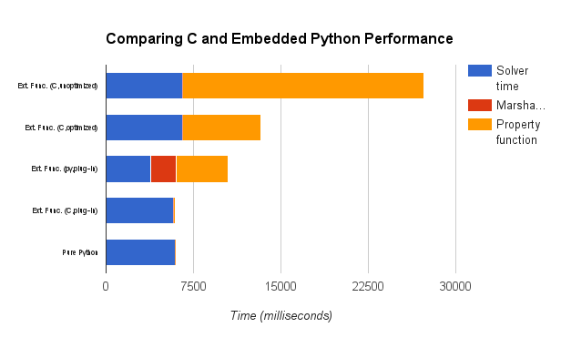

================
Python/C Wrapper 
================
Overview and Motivation:
------------------------ 

In developing the property model library, there was a need to achieve good usability while also ensuring little to no performance losses. This is the motivation to develop the Python-C wrapper. It provides a simple way of wrapping pure Python methods in C code that could then be called transparently by a solver. 

Initial performance measurments showed an acceptable performance downgrade for this technique when compared with pure C see below:

Required Features:
------------------

- Create the macro function and add it to a .h file. The macro should generate some stub code that calls a wrapper function.
- A generic wrapper function that does all the actual serializing/deserializing of data and python code invocation.
- Experiment with a reuse function to optimize performance if the function name and the arglist has been used before.

How To Use Wrapper:
-------------------

1. Assumptions on the argument list passed to the C method: 

   - The total number of real single-valued arguments is given by al->n (n for convenience).
   - Two potential additional arguments are derivatives (al->derivs) and the Hessian matrix (al->hes). 
   - al->dervis will be passed to Python as a Python list of length n. 
   - al->hes will be passed to Python as a Python list of length (n*n-n)/2 + n. 
   - Because Python changes to arguments are local to the method, all Python methods will need to return a list containing the return value along with the method's changes to derivatives and the Hessian matrix, e.g: [return_value,derivs,hes]. This order will be important to marshall these methods correctly back into the arglist structure. 

2. General Instructions (compilation and running)
3. Example